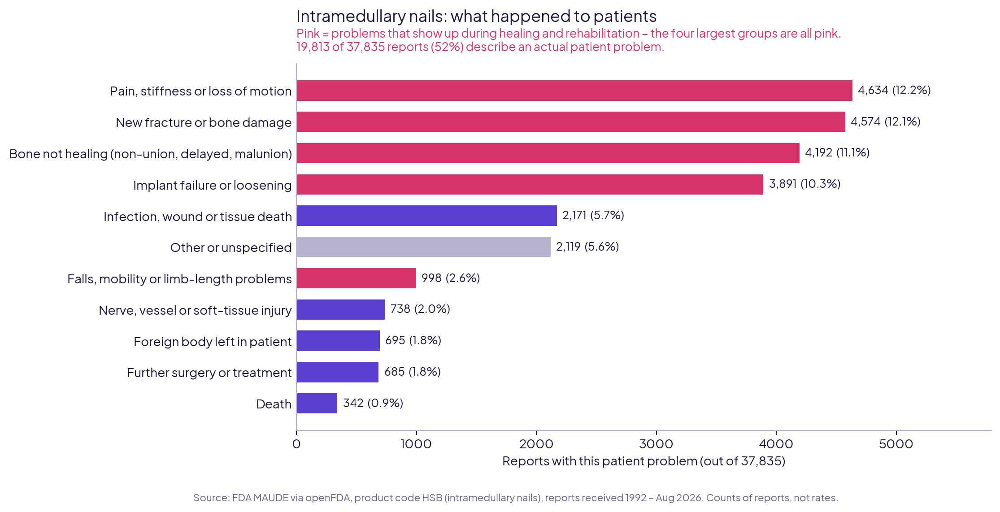
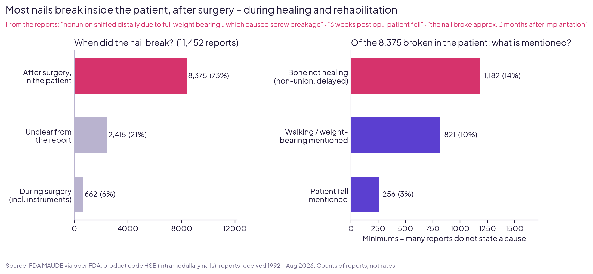

# Fracture Fixation Nails – What 37,835 FDA Reports Reveal

**Intramedullary nails (femur, tibia, hip) – problems during healing and rehabilitation, read by a physiotherapist**

*Dr. Muhammad Ali, DPT · Medical Researcher and Data Analytics*

---

## The question

What problems are reported for intramedullary fracture nails, what happens to patients, and how many problems relate to bone healing, loading and rehabilitation?

**Built for:** orthopaedic implant manufacturers and distributors, hospital trauma and rehabilitation teams.

## Key findings

| # | Finding | Why it matters |
|---|---|---|
| 1 | **37,835 reports** (1992 – Aug 2026), every one of 35 years verified against the FDA's own count | Complete, verified dataset |
| 2 | **52.4%** of reports (19,813) describe an actual patient problem; 66% are filed as injuries | A nail stays in the bone for months – problems show up in the patient |
| 3 | The **four largest patient problems** are about healing: pain / stiffness (4,634), new fracture (4,574), **bone not healing** (4,192), implant failure or loosening (3,891) | Recovery, not the operation, is where most problems appear |
| 4 | Of **11,452** breakage reports, **73% (8,375)** broke **inside the patient after surgery**; only 6% during surgery | Breakage is mostly a healing-period event |
| 5 | Of those broken in the patient, at least **14%** also record bone not healing, **10%** mention walking / weight-bearing, **3%** a patient fall | *"Nonunion shifted distally due to full weight bearing… which caused screw breakage"* |
| 6 | 115 reports are filed as deaths | Many patients are elderly with hip fractures – deaths are often not device-related |

### What this means for rehabilitation
- **Progress weight-bearing according to bone healing**, not only the calendar.
- **Persistent pain at the fracture site, new pain while stepping or a limp that does not improve** are early warning signs of non-union or implant failure – report them to the surgeon before the nail breaks.
- **Fall prevention** is part of fracture care, especially for older patients with weak bone.

## Charts

## How it was done, and how accuracy is proven

Every step ends with **gates**: automatic checks that stop the notebook if a number does not match its source.

1. **Download:** all 37,835 FDA MAUDE reports for product code HSB via openFDA, **year by year** (the API allows max 25,000 per query). *Gates:* each of 35 years = FDA count for that year, total = FDA total, no duplicates, saved file complete.
2. **Table:** one row per report. *Gate:* death / injury / malfunction / other / blank counts equal the FDA's own count, requested separately.
3. **Problems:** the FDA's coded device and patient problem terms; "no harm / no information" terms separated.
4. **Clinical categories:** patient problems grouped into 10 categories built from the data and reviewed by a physiotherapist (terms moved out of "Other" after review are documented).
5. **Breakage:** breakage reports split by timing (during surgery incl. instruments / after surgery in the patient / unclear), then linked to non-healing, loading and falls; keyword rules tightened after reading examples.
6. **Results** saved and re-read (gate: identical), charts checked against the saved tables, every headline number recalculated in the final step.

## Files

| Folder | Contents |
|---|---|
| [`notebooks/`](notebooks) | `fracture_fixation_fda_01_download_and_verify.ipynb` – download and verification · `fracture_fixation_fda_02_problems_and_healing.ipynb` – problems, clinical categories, breakage, charts, findings |
| [`figures/`](figures) | Charts (PNG) |
| [`data/clean/`](data/clean) | `nail_reports.csv` (37,835 reports) · `clinical_categories.csv` · `top_device_problems.csv` · `breakage_timing.csv` · `breakage_after_surgery.csv` |
| [`data/raw/`](data/raw) | `hsb_reports_raw.jsonl.gz` – all reports exactly as downloaded |

**Tools:** Python (pandas, requests, matplotlib) in Google Colab.

## Limitations
- **Counts, not rates.** The FDA does not publish how many nails are implanted, so brands cannot be compared on safety.
- **MAUDE reports are unverified and incomplete.** Product code HSB also includes instruments (e.g. insertion handles, drills).
- **The non-healing, loading and fall shares are minimums** – many reports are very short and do not state a cause.
- The reports concern **global brands** (e.g. Synthes, Stryker, Smith & Nephew, Zimmer Biomet); the patterns apply to intramedullary nails in general, not to one manufacturer.

## Data source
U.S. Food and Drug Administration, MAUDE adverse-event database, accessed through [openFDA](https://open.fda.gov/apis/device/event/) (product code HSB, database updated 2026-09-22). openFDA notes that its data is unvalidated and should not be used for medical decisions.

---

**Contact:** muhammadali17598@gmail.com · +966 57 087 8136
